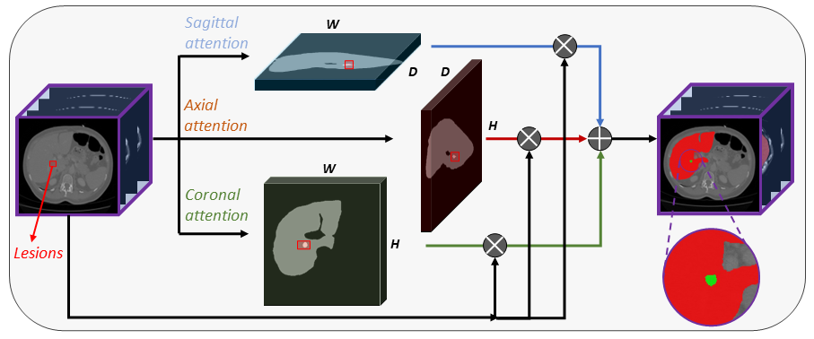

# APAUNet



---

## Introduction

By [Yuncheng Jiang*](https://scholar.google.com/citations?user=v5jDFU8AAAAJ&hl=zh-CN), [Zixun Zhang*](https://scholar.google.com/citations?user=13FeVFsAAAAJ&hl=zh-CN), [Shixi Qin](), [Yao guo](), [Zhen Li](https://scholar.google.com/citations?user=0TTt3QsAAAAJ&hl=zh-CN), [Shuguang Cui](https://scholar.google.com/citations?user=1o_qvR0AAAAJ&hl=zh-CN).

This repo is an PyTorch implementation of ["APAUNet: Axis Projection Attention UNet for Small Target Segmentation in 3D Medical Images"](https://arxiv.org/abs/2210.01485), accepted by ACCV 2022.

APAUNet is a segmentation network for 3D medical image data. It aims to improve the small targe segmentation accuracy using projection 2D attention mechanism on three axes. For more details, please refer to our paper.

---

## Requirement

* python 3.8
* pytotch 1.11.0_cu113
* torchvision 0.12.0+cu113
* opencv(cv2) 4.5
* tensorboard
* monai
* medpy
* SimpleITK
* nibabel
* einops

```
pip install -r requirements.txt  # install requirements
```

---

## Dataset

### 1. Dataset download

Datasets can be acquired via following links:
* [Medical Segmentation Decathlon: Liver and Pancreas](https://drive.google.com/drive/folders/1HqEgzS8BV2c7xYNrZdEAnrHk7osJJ--2)
* [The Synapse multi-organ CT dataset](https://www.synapse.org/#!Synapse:syn3193805/wiki/217789)

### 2. Setting up the datasets

After you have downloaded the datasets, you can follow the settings in nnUNet for path configurations and preprocessing procedures. Finally, your folders should be organized as follows:

```
./DATASET/
  ├── nnUNet_raw/
      ├── nnUNet_raw_data/
          ├── Task01_Liver/
              ├── imagesTr/
              ├── imagesTs/
              ├── labelsTr/
              ├── labelsTs/
              ├── dataset.json
          ├── Task02_Pancreas/
              ├── imagesTr/
              ├── imagesTs/
              ├── labelsTr/
              ├── labelsTs/
              ├── dataset.json
          ├── Task03_Synapse/
              ├── imagesTr/
              ├── imagesTs/
              ├── labelsTr/
              ├── labelsTs/
              ├── dataset.json
      ├── nnUNet_cropped_data/
  ├── nnUNet_trained_models/
  ├── nnUNet_preprocessed/
```

### 3. Pre-processing

After that, you can preprocess the above data using following commands:
```
nnUNet_convert_decathlon_task -i ../DATASET/nnUNet_raw/nnUNet_raw_data/Task01_Liver
nnUNet_convert_decathlon_task -i ../DATASET/nnUNet_raw/nnUNet_raw_data/Task02_Pancreas
nnUNet_convert_decathlon_task -i ../DATASET/nnUNet_raw/nnUNet_raw_data/Task03_Synapse

nnUNet_plan_and_preprocess -t 1
nnUNet_plan_and_preprocess -t 2
nnUNet_plan_and_preprocess -t 3
```
Then the pre-processed data are stored in separate folders, for example:
```
nnUNet_preprocessed/Task001_Liver/nnUNetData_plans_v2.1_stage0
```

---

## Usage 

### 0. Config

All the training and testing hyper-parameters are set in [config.py](config.py). You can modify these configurations according to your requirements.

### 1. Training

```
python train.py 
```

### 2. Inference

```
python inference.py
```
It will produce a predicted segmentation mask for the given testing data. Then you can use [ITK-Snap](http://www.itksnap.org) to visualize the infernce results.

### 3. Cross-fold validation

```
python train_fold.py
```
The default fold number is 5.

---

## Citation

```
@inproceedings{apaunet2022,
    title={APAUNet: Axis Projection Attention UNet for Small Target Segmentation in 3D Medical Images},
    author={Jiang, Yuncheng and Zhang, Zixun and Qin, Shixi and Guo, Yao and Li, Zhen and Cui, Shuguang},
    booktitle={Proceedings of the Asian Conference on Computer Vision},
    year={2022}
}
```